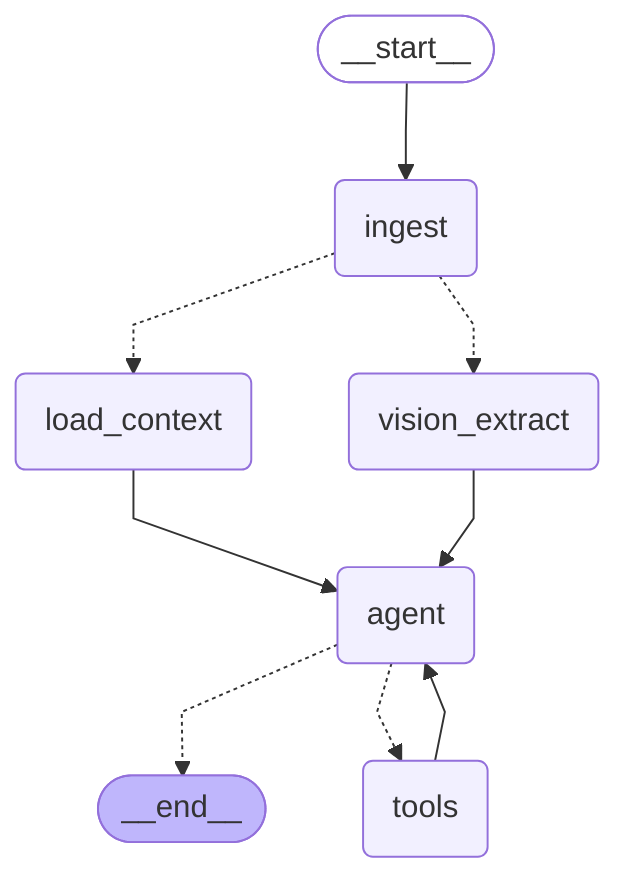

# CalorAI agent graph

Generated from the compiled LangGraph with `python scripts/render_graph.py`.



```text
              +-----------+                 
              | __start__ |                 
              +-----------+                 
                     *                      
                     *                      
                     *                      
                +--------+                  
                | ingest |                  
                +--------+.                 
              ..           ..               
            ..               ..             
          ..                   ..           
+--------------+         +----------------+ 
| load_context |         | vision_extract | 
+--------------+         +----------------+ 
              **           **               
                **       **                 
                  **   **                   
                +-------+                   
                | agent |                   
                +-------+.                  
                .         .                 
              ..           ..               
             .               .              
      +---------+         +-------+         
      | __end__ |         | tools |         
      +---------+         +-------+         
```
